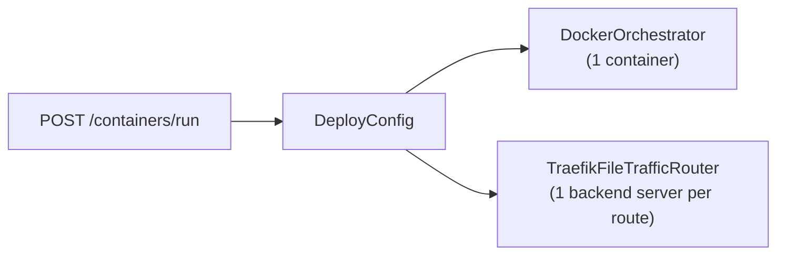

# Auto-scaling Epic

Three cards form a vertical slice: DB model → backend engine → frontend UI.

---

## Current state (key constraints)



- No SQL `containers` table; live state lives in Docker labels.
- `RouteSpec` carries a single `backend_host`/`backend_port`; Traefik JSON has one `loadBalancer.servers` entry.
- No replicas, scaling, or multi-instance concept exists.

---

## Card 64 — Model & Policy Persistence

### New DB table (`backend/app/db/models.py`)

Add `ScalingPolicy` ORM model:
- `id` (UUID PK), `container_name` (str, unique index — ties to the route/service name)
- `enabled` (bool)
- `min_replicas` (int, ≥ 1), `max_replicas` (int)
- `metric` (`"cpu_percent"` | `"requests_per_second"`)
- `scale_up_threshold` (float), `scale_down_threshold` (float)
- `cooldown_seconds` (int — prevents thrashing)
- `created_at`, `updated_at`

### Alembic migration

New migration in [`backend/alembic/versions/`](backend/alembic/versions/) for the `scaling_policies` table.

### Domain models (`backend/app/core/models.py`)

Add Pydantic models alongside the existing `DeployConfig`:
- `ScalingMetric` enum: `cpu_percent`, `requests_per_second`
- `ScalingPolicyConfig` — mirrors the DB fields, used in `DeployConfig` and `RunFromSourceRequest`
- `ScalingPolicyInfo` — read model returned in responses

### API schema (`backend/app/api/schemas.py`)

Add `scaling_policy: ScalingPolicyConfig | None = None` to `RunFromSourceRequest`.
Add `scaling_policy: ScalingPolicyInfo | None` to `RunFromSourceResponse`.

### Scaling domain package

New `backend/app/core/scaling/` package:
- `__init__.py`
- `policy_repository.py` — CRUD against `scaling_policies` via SQLAlchemy session
- `scaling_engine.py` — the scale-loop logic (Card 65 depends on this)

### Route

Add `GET/PUT /api/scaling/policies/{container_name}` in a new `backend/app/api/routes/scaling.py` to allow reading/updating a policy after initial deploy.

---

## Card 65 — Traefik Multi-backend Engine

### 1. Extend `RouteSpec` (`backend/app/core/traffic/traffic_models.py`)

Replace single `backend_host`/`backend_port` with:

```python
class BackendServer(BaseModel):
    host: str
    port: int

class RouteSpec(BaseModel):
    route_id: str
    host: str
    path_prefix: str
    backend_servers: list[BackendServer]   # replaces backend_host / backend_port
    tls_enabled: bool
    entrypoints: set[str]
```

`route_wiring.py` constructs a single-element list for existing deploys — no behavior change unless scaling is enabled.

### 2. Update `TraefikFileTrafficRouter` (`backend/app/core/traffic/traefik_file_traffic_router.py`)

`_build_traefik_document` generates:
```json
"loadBalancer": {
  "servers": [{"url": "http://host1:port"}, {"url": "http://host2:port"}]
}
```
All current callers pass one server — backward compatible.

### 3. Add replica management to `DockerOrchestrator` (`backend/app/core/containers/docker_orchestrator.py`)

New methods on the orchestrator interface (`orchestrator.py`):
- `list_replicas(base_name: str) -> list[ContainerInfo]` — finds containers with label `vela.replica_of={base_name}`
- `deploy_replica(base_config: DeployConfig, replica_index: int) -> ContainerInfo` — clones config, sets name `{base_name}-r{N}`, adds label `vela.replica_of={base_name}`

### 4. `ScalingEngine` (`backend/app/core/scaling/scaling_engine.py`)

```
ScalingEngine.tick(container_name)
  1. Load ScalingPolicy for container_name
  2. Measure current metric (docker stats CPU or Traefik request rate)
  3. Count live replicas via orchestrator.list_replicas()
  4. Decide: scale_up / scale_down / hold (respecting cooldown_seconds)
  5. scale_up  → orchestrator.deploy_replica() + traffic_router.upsert_route() with new servers list
  6. scale_down → traffic_router.upsert_route() with reduced servers list + orchestrator.remove()
  7. Update ScalingPolicy.updated_at / last_scaled_at
```

A background `asyncio` task launched from `app.py` `lifespan` calls `tick` every 15 seconds for each policy where `enabled=True`.

### 5. Persist policy on `/run` (`backend/app/api/routes/containers.py`)

After a successful deploy, if `scaling_policy` is present in the request, call `policy_repository.upsert(container_name, policy)`.

---

## Card 66 — Frontend: Auto-scaling in Run Form

### New component

`frontend/src/pages/containers/ContainersRunScalingFields.tsx`

A collapsible section (same pattern as `ContainersRunAdvancedFields`) with:
- Toggle: **Enable auto-scaling**
- When enabled (4 fields):
  - **Min replicas** (number input, default `1`)
  - **Max replicas** (number input, default `3`)
  - **Scale metric** (select: `CPU %` | `Requests/sec`)
  - **Scale-up threshold** (number with unit label — e.g. `70 %`)
  - **Scale-down threshold** (number with unit label — e.g. `30 %`)

### Types (`frontend/src/api/client.ts`)

```typescript
export type ScalingMetric = 'cpu_percent' | 'requests_per_second'

export interface ScalingPolicyRequest {
  enabled: boolean
  min_replicas: number
  max_replicas: number
  metric: ScalingMetric
  scale_up_threshold: number
  scale_down_threshold: number
}
```

Add `scaling_policy?: ScalingPolicyRequest | null` to `RunFromSourceRequest`.

### State in `ContainersPage.tsx`

Add `scalingPolicy` state (nullable `ScalingPolicyRequest`).
Pass to `buildRunRequest()` → included in the POST body.
Render `<ContainersRunScalingFields>` below `ContainersRunAdvancedFields`.

---

## Implementation order

1. Card 64 first (DB + models + policy_repository) — no runtime behavior, safe to land alone.
2. Card 65 second — depends on `ScalingPolicyConfig` from Card 64; extends traffic layer.
3. Card 66 last — purely additive frontend; depends on the API accepting `scaling_policy`.

---

## Files changed (summary)

- `backend/app/db/models.py` — add `ScalingPolicy` ORM
- `backend/alembic/versions/<new>.py` — migration
- `backend/app/core/models.py` — `ScalingPolicyConfig`, `ScalingPolicyInfo`, `ScalingMetric`
- `backend/app/core/traffic/traffic_models.py` — `BackendServer`, update `RouteSpec`
- `backend/app/core/traffic/traefik_file_traffic_router.py` — multi-server Traefik generation
- `backend/app/core/containers/orchestrator.py` — `list_replicas`, `deploy_replica` on ABC
- `backend/app/core/containers/docker_orchestrator.py` — implement new methods
- `backend/app/core/containers/fake_orchestrator.py` — implement new methods for tests
- `backend/app/core/scaling/__init__.py`, `policy_repository.py`, `scaling_engine.py` — new package
- `backend/app/api/schemas.py` — `scaling_policy` on request/response
- `backend/app/api/routes/containers.py` — save policy post-deploy
- `backend/app/api/routes/scaling.py` — policy CRUD endpoints
- `backend/app/api/route_wiring.py` — pass `backend_servers` list
- `backend/app.py` — register scaling background task in lifespan
- `frontend/src/api/client.ts` — `ScalingPolicyRequest` type + field on `RunFromSourceRequest`
- `frontend/src/pages/containers/ContainersRunScalingFields.tsx` — new component
- `frontend/src/pages/ContainersPage.tsx` — new state + render scaling fields
