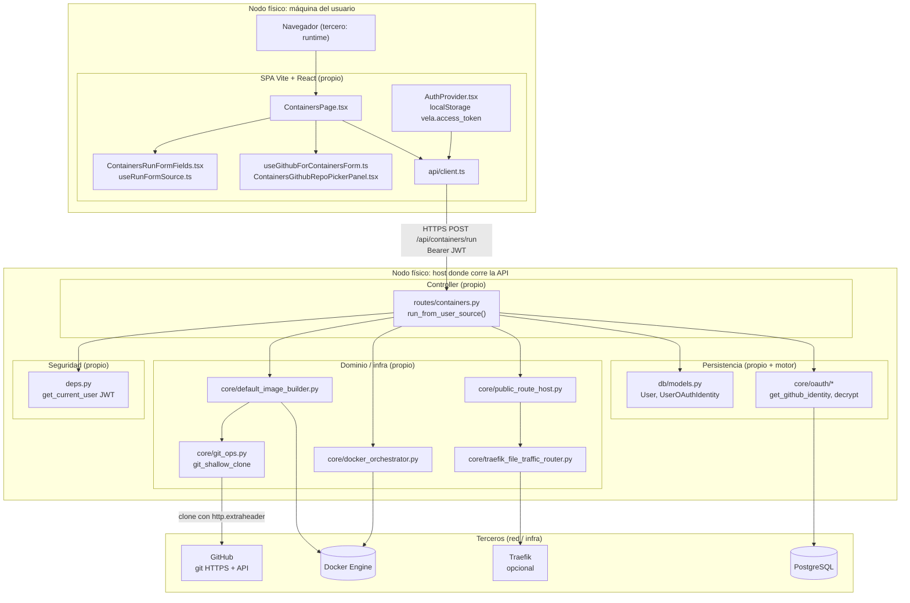
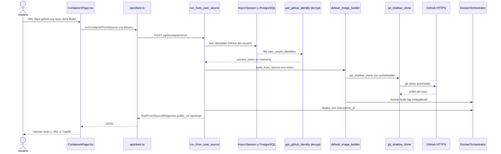

# Diagrama de arquitectura — Entrega 1 (Vela)

Documentación general de arquitectura para la asignatura, usando una **user story testigo** concreta: **un usuario ya autenticado en Vela y con GitHub conectado en Settings despliega un workload a partir de la URL HTTPS de un repositorio GitHub privado de su cuenta** (sin reconfigurar OAuth en este flujo).

---

## 1. Leyenda: capas, propios vs terceros

| Convención         | Significado                                                                                                                  |
| ------------------ | ---------------------------------------------------------------------------------------------------------------------------- |
| **Propios**        | Código y configuración del monorepo Vela (`frontend/`, `backend/`).                                                          |
| **Terceros**       | Servicios o productos externos: navegador como runtime, PostgreSQL, Docker Engine, GitHub.com, Traefik (si está habilitado). |
| **Vista / UI**     | React: páginas, hooks y componentes bajo `frontend/src/`.                                                                    |
| **Controller**     | Rutas FastAPI y wiring HTTP bajo `backend/app/api/`.                                                                         |
| **Dominio / core** | Reglas y orquestación en `backend/app/core/`.                                                                                |
| **Persistencia**   | SQLAlchemy + Alembic bajo `backend/app/db/`.                                                                                 |
| **Seguridad**      | JWT, OAuth, cifrado de tokens en reposo, comprobación de propiedad de contenedores.                                          |

---

## 2. Diagrama general (despliegue lógico y nodos)

Vista **cliente / servidor** y **dónde corre** cada bloque. Los diagramas están en **Mermaid** (texto en GitHub se renderiza solo en vistas que soporten Mermaid; si no, copiá el bloque a [mermaid.live](https://mermaid.live) y exportá **PNG** o **SVG**).

---

## 3. Diagrama de secuencia (caso: repo privado HTTPS)

Enfocado en el **camino Git** de `run_from_user_source` (no el de imagen directa de registry).

---

## 5. Responsabilidades por componente (un párrafo cada uno)

### Vista / cliente (propio)

`**frontend/src/pages/ContainersPage.tsx**`  
Orquesta el estado del formulario de despliegue (fuente Git o imagen, rama, puerto, mensajes de éxito/error), dispara `runContainerFromSource` al enviar y refresca la lista de workloads; compone los subcomponentes del directorio `pages/containers/` y conecta el listado con `useContainerList`.

`**frontend/src/pages/containers/useRunFormSource.ts**` y `**ContainersRunFormFields.tsx**`  
Centralizan el valor del campo de fuente, detectan si la URL parece Git (rama y puerto por defecto para stacks tipo Vite) y renderizan los inputs; no conocen el token de GitHub, solo la URL que el usuario confirma.

`**frontend/src/pages/containers/useGithubForContainersForm.ts**` y `**ContainersGithubRepoPickerPanel.tsx**`  
En el testigo el usuario puede pegar la URL de un repo privado sin abrir el picker; si lo usa, el picker alimenta el campo con `repo.html_url` y la rama por defecto. El hook consulta el estado de GitHub para saber si la integración está disponible en la UI.

`**frontend/src/api/client.ts` (`runContainerFromSource`)**  
Serializa el cuerpo `RunFromSourceRequest` y envía `POST /api/containers/` con cabeceras JSON y **Bearer** leído del almacenamiento que arma `AuthProvider`; traduce errores HTTP en mensajes para el usuario vía `formatApiError`.

`**frontend/src/auth/AuthProvider.tsx` y `AuthContext.ts`**  
Mantienen el JWT de sesión del usuario Vela (registro/login previos); sin este token el backend rechaza el run y la ruta `/containers` está protegida por `RequireAuth` en `App.tsx`.

### Controller / API (propio)

`**backend/app/api/routes/containers.py` — `run_from_user_source**`  
Punto de entrada HTTP del caso testigo: infiere imagen vs Git, para Git obtiene un token de GitHub del usuario, invoca `DefaultImageBuilder.build_from_source`, construye `DeployConfig` con política de ruta pública y delega en `_deploy_and_maybe_wire_route` y `_with_owner_label` para etiquetar el contenedor con el dueño.

`**backend/app/api/routes/containers.py` — `_github_token_for_url` y `_require_owned**`  
`_github_token_for_url` resuelve si la URL es GitHub HTTPS y, vía sesión de base de datos, recupera y descifra el token almacenado; si falta y el clone falla por auth, se eleva un mensaje que orienta a conectar GitHub. `_require_owned` asegura que cualquier otra operación sobre un `container_id` respete `vela.owner_id`.

`**backend/app/api/deps.py` — `get_current_user`, `get_db`, `get_image_builder`, `get_orchestrator`, `get_traffic_router**`  
Inyectan en las rutas el usuario autenticado (JWT), la sesión async de SQLAlchemy, el builder de imágenes singleton y el orquestador Docker y el router de tráfico según variables de entorno.

### Dominio / core (propio)

`**backend/app/core/default_image_builder.py**`  
Implementa el pipeline declarado en `ImageBuilder`: clonar (o usar path local en otros flujos), analizar el proyecto (`project_analysis.py`), asegurar un `Dockerfile` y ejecutar `docker build` contra el daemon, produciendo un tag local usado luego como imagen de deploy.

`**backend/app/core/git_ops.py` — `git_shallow_clone` y `_build_clone_command**`  
Arma el comando `git` con `http.extraheader=Authorization: Basic …` para inyectar el token sin ponerlo en la URL visible del proceso, y gestiona timeouts y errores sanitizados (`CloneError`).

`**backend/app/core/docker_orchestrator.py**`  
Traduce `DeployConfig` en llamadas al SDK de Docker (pull, create, start, labels `vela.owner_id`, etc.) y expone list/get/logs usados por el resto de la API.

`**backend/app/core/public_route_host.py` y `traefik_file_traffic_router.py**`  
Si `public_route` está activo, calculan host público y escriben/actualizan el JSON dinámico de Traefik (modo archivo) y opcionalmente disparan recarga del contenedor Traefik.

### Persistencia y seguridad de integración (propio + motor tercero)

`**backend/app/db/models.py` — `User`, `UserOAuthIdentity**`  
`User` representa la cuenta local; `UserOAuthIdentity` guarda el vínculo con GitHub y el **token cifrado** (`access_token_encrypted`); el motor es **PostgreSQL** (tercero) configurado con `VELA_DATABASE_URL`.

`**backend/app/core/oauth/` (p. ej. `get_github_identity`, funciones de cifrado)**  
Abstrae lectura/escritura de identidades OAuth y el descifrado puntual del token para uso en clone/build; el flujo de *conexión* inicial vive en `routes/github.py` (fuera del testigo estricto, pero es prerrequisito).

### Terceros

**GitHub (git + API)**  
Hostea el repositorio privado; `git` en el servidor del backend se conecta por HTTPS usando credenciales derivadas del OAuth del usuario.

**Docker Engine**  
Ejecuta `git` subprocess y `docker build` / `docker run` iniciados por el backend en el mismo host (o socket configurado).

**PostgreSQL**  
Persiste usuarios y tokens OAuth cifrados.

**Traefik (opcional)**  
Publica el workload bajo un hostname si `VELA_TRAFFIC_ROUTER=traefik_file` y el archivo dinámico están configurados.

---

