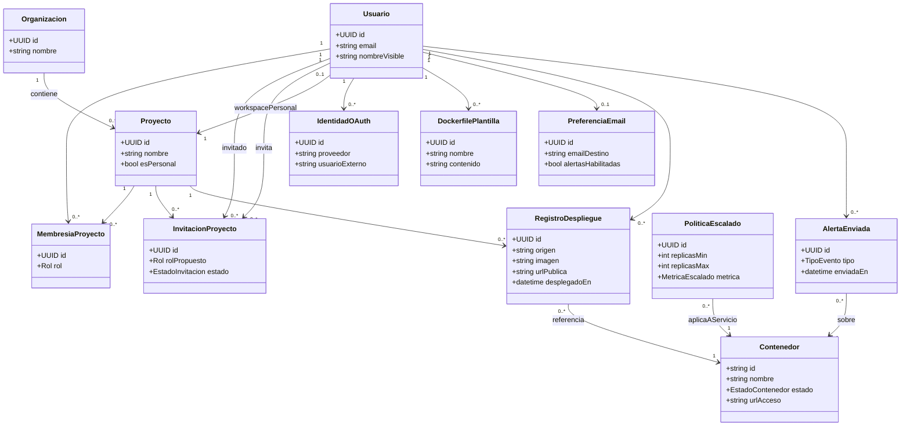

# Diagrama de entidades — Entrega final (Vela)

Solo incluye objetos del dominio. **No** aparecen componentes arquitecturales (API FastAPI, Docker Engine, Traefik, React, etc.).

El diagrama refleja el **modelo físico relacional** implementado en `backend/app/db/models.py`. Los contenedores en ejecución viven en Docker; Vela los referencia por `container_id` / `container_name` en tablas propias, sin persistirlos como fila aparte.

## 1. Resumen de relaciones

| Relación                            | Cardinalidad   | Implementación                                                                               |
| ----------------------------------- | -------------- | -------------------------------------------------------------------------------------------- |
| Organización → Proyecto             | 1 : N          | FK `projects.organization_id`                                                                |
| Usuario ↔ Proyecto (miembros)       | N : M          | Tabla intermedia `project_memberships` (rol: owner / operator / viewer)                      |
| Usuario → Proyecto personal         | N : 0..1       | FK opcional `users.personal_project_id` (cada usuario tiene a lo sumo un workspace personal) |
| Usuario → Identidad OAuth           | 1 : N          | FK `user_oauth_identities.user_id` (p. ej. GitHub)                                           |
| Usuario → Dockerfile (biblioteca)   | 1 : N          | FK `dockerfiles.owner_id`                                                                    |
| Usuario → Preferencias de email     | 1 : 0..1       | FK única `email_preferences.user_id`                                                         |
| Usuario → Registro de despliegue    | 1 : N          | FK `deployment_records.user_id`                                                              |
| Proyecto → Registro de despliegue   | 1 : N          | FK opcional `deployment_records.project_id`                                                  |
| Proyecto → Invitación               | 1 : N          | FK `project_invitations.project_id`                                                          |
| Usuario (invitado) → Invitación     | 1 : N          | FK `project_invitations.invitee_user_id`                                                     |
| Usuario (quien invita) → Invitación | 1 : N          | FK `project_invitations.invited_by_user_id`                                                  |
| Usuario → Historial de alerta       | 1 : N          | FK `alert_history.user_id`                                                                   |
| Política de escalado → Contenedor   | N : 1 (lógica) | Sin FK: `scaling_policies.container_name` identifica el servicio en Docker                   |

**Nota sobre N:M:** La relación muchos-a-muchos entre Usuario y Proyecto existe solo a nivel lógico; en la base física se resuelve con `project_memberships`.

**Nota sobre 1FN:** Atributos multivaluados del dominio (p. ej. tipos de alerta habilitados) se omiten del diagrama o se normalizarían en tablas aparte; en la implementación actual algunos se guardan como JSON escalar (`email_preferences.alert_types`).

## 2. Diagrama de clases (alternativa, objetos de dominio)

Si preferís comunicar el modelo orientado a objetos (sin detalle de tablas), podés usar este diagrama. Muestra los objetos más importantes y sus asociaciones; los atributos son los relevantes para el negocio.

**Contenedor** es entidad de negocio central (workload desplegado), pero su estado runtime lo administra Docker; Vela lo expone vía API y lo referencia desde `RegistroDespliegue`, `PoliticaEscalado` y `AlertaEnviada`.

---

